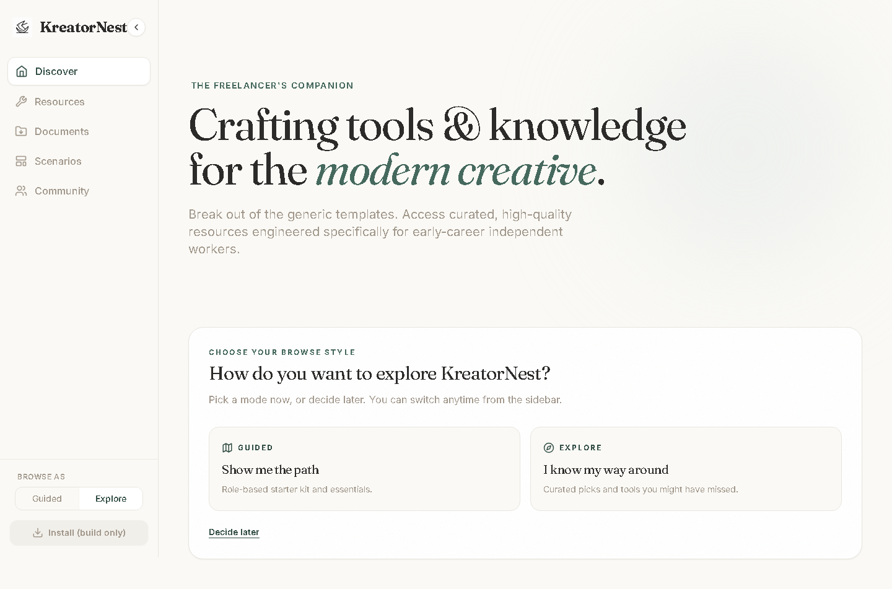
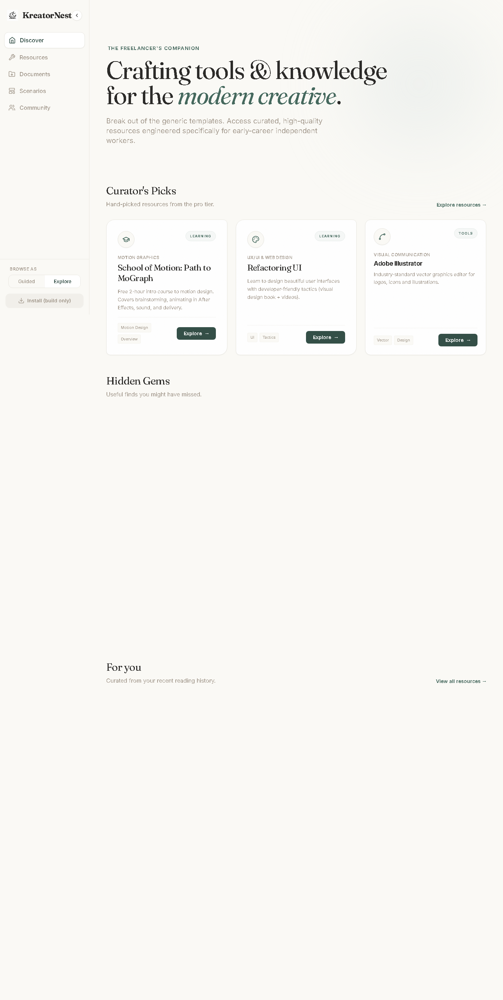
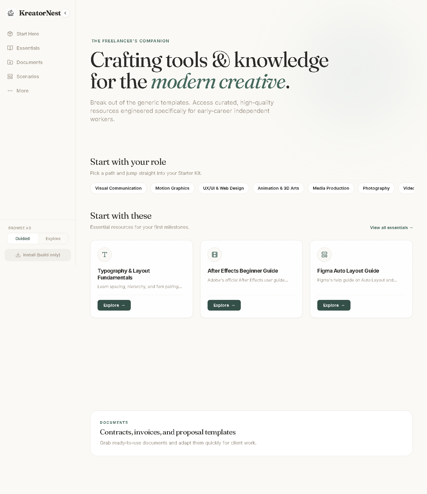
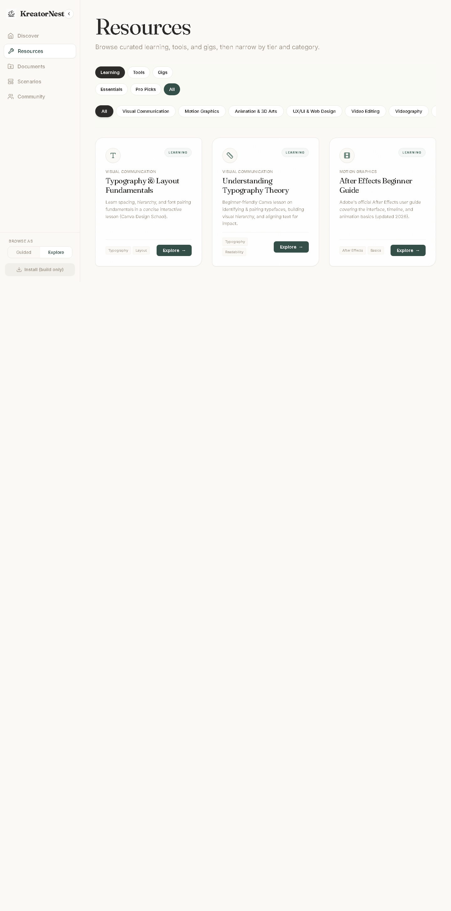
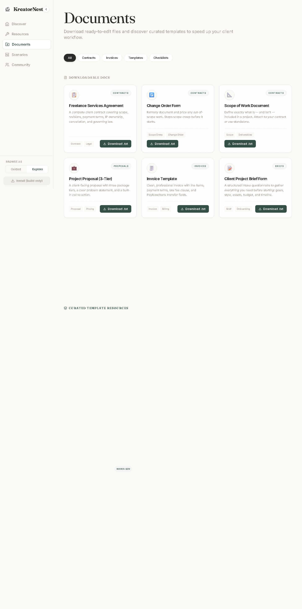
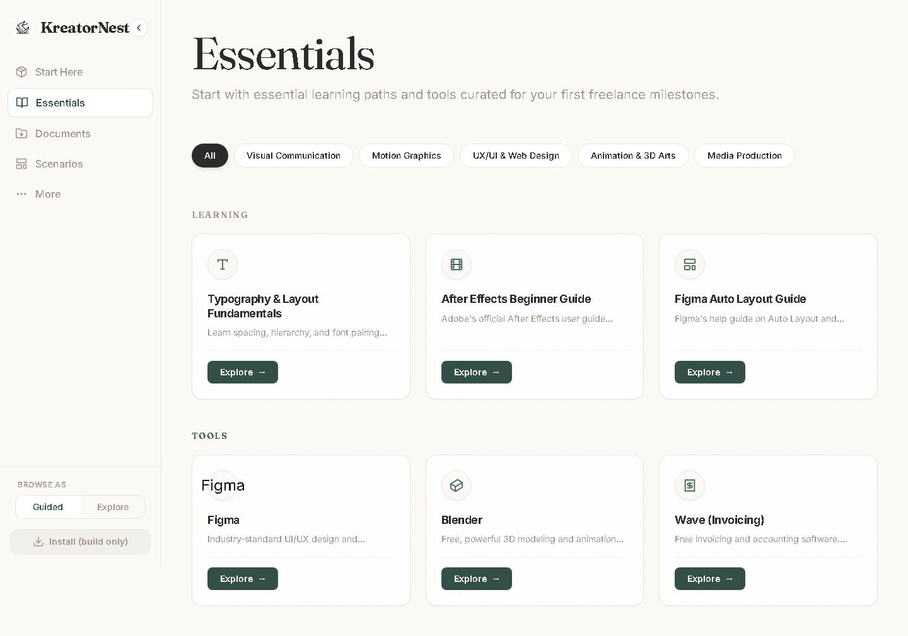
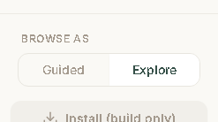

# Dual-Mode IA — Final Review Report

**Date:** 2026-07-01  
**Branch:** `feat/dual-mode-ia`  
**Spec:** [2026-07-01-dual-mode-ia-design.md](../specs/2026-07-01-dual-mode-ia-design.md)  
**Reviewer:** Automated review + Playwright screenshots  
**Screenshots:** `docs/review-screenshots/`

---

## Executive Summary

**Verdict: Approved with minor follow-ups**

The dual-mode IA refactor successfully addresses the original problem — KreatorNest felt crowded and overwhelming. Navigation dropped from 11 flat items to **5 per mode**, the home bento grid is gone, and content is tier-curated for Guided vs Explore audiences. Typography (Fraunces + Inter) and the organic/primary palette are preserved.

| Check | Result |
|-------|--------|
| Spec goals (Guided path + Explore discovery) | Met |
| Reversible mode switch | Met |
| Visual identity unchanged | Met |
| Mobile responsive | Met (desktop verified; mobile capture partial) |
| Tests | **50/50 pass** |
| Production build | **Pass** |
| Legacy URL redirects | Met (tested) |

---

## Screenshots

### 1. First-visit fork (mode unset)

New users see an inline choice — not a blocking modal. Copy frames browse preference, not skill level.



**Observations:** Fork card sits naturally under hero. Sidebar already shows Explore nav (effective default) while fork is visible — acceptable; explicit pick updates toggle.

---

### 2. Explore home — Discover

Bento grid removed. Replaced by Curator's Picks (3 pro-tier cards) and Hidden Gems section.



**Observations:**
- Curator's Picks render correctly with full `ResourceCard` metadata
- Hidden Gems + "For you" appear below fold (scroll) — expected on 1440×900
- Sidebar: Discover · Resources · Documents · Scenarios · Community (5 items)

---

### 3. Guided home

Role strip, compact essential cards, Documents CTA — no recommendation noise.



**Observations:**
- Compact cards hide badges/tags as designed
- Role pills link to `/starter-kit?role=…`
- Sidebar: Start Here · Essentials · Documents · Scenarios · More

---

### 4. Explore Resources hub

Tabbed Learning / Tools / Gigs + tier tabs + category filters.



**Observations:** Triple filter (type × tier × category) adds power without sidebar clutter. Good for advanced users.

---

### 5. Documents hub (merged Templates + Downloads)

Single destination for contracts, invoices, templates, checklists.



**Observations:** Download cards + curated template resources in one page. Hidden gem badge visible on template section.

---

### 6. Guided Essentials

Essential-tier Learning + Tools only, compact cards, category filter.



**Observations:** Clearer than old separate Learning/Tools hubs for beginners.

---

### 7. Browse mode toggle (sidebar foot)

Segmented control — one tap switch, always visible.



**Observations:** Matches spec (not dropdown). `aria-pressed` + `role="group"` implemented. Redirect on unavailable routes wired in toggle.

---

## Spec Compliance Matrix

| Requirement | Status | Evidence |
|-------------|--------|----------|
| Guided ≤5 nav items | ✅ | Screenshot 03, 06 |
| Explore ≤5 nav items | ✅ | Screenshot 02, 04 |
| Segmented sidebar toggle | ✅ | Screenshot 09 |
| First-visit fork | ✅ | Screenshot 01 |
| Templates + Downloads → Documents | ✅ | Screenshot 05, `/documents` route |
| Legacy redirects | ✅ | `LegacyRedirect.test.jsx` (8 cases) |
| `tier` editorial tags | ✅ | 17 resources tagged |
| `pinned` scenario posts (3) | ✅ | Guided scenarios simplified |
| ResourceCard compact (Guided) | ✅ | Screenshots 03, 06 |
| Fraunces/Inter + organic palette | ✅ | Visual review |
| `localStorage` v1 schema | ✅ | `useBrowseMode.test.js` |
| `startTransition` on mode switch | ✅ | `BrowseModeContext.jsx` |

---

## Architecture Review

**Strengths**

- **Clean separation:** `navigation.js` (data) → Sidebar (presentation) → pages (mode branches)
- **Single context source:** `BrowseModeProvider` at App root; no prop drilling
- **Redirect logic centralized:** `BrowseModeToggle` + `LegacyRedirect` — predictable
- **Bundle discipline:** explicit `navIcons.js` map; lazy `VerticalScrollSlider` in Explore scenarios
- **Test coverage:** 50 tests across mode hook, toggle, redirects, cards, app smoke

**File map (new/changed core)**

```
src/context/BrowseModeContext.jsx
src/hooks/useBrowseMode.js
src/config/navigation.js
src/components/BrowseModeToggle.jsx
src/components/LegacyRedirect.jsx
src/utils/navIcons.js
src/utils/tierFilters.js
src/pages/Documents.jsx, Essentials.jsx, Resources.jsx, More.jsx, Community.jsx
```

---

## Issues & Recommendations

### Minor (non-blocking)

1. **`effectiveMode` ternary is redundant** in `BrowseModeContext` — `forkDismissed ? 'explore' : 'explore'`. Behavior correct; could simplify to `mode ?? 'explore'` for readability.

2. **"Decide later" state** — user sees Explore nav before picking a mode. Spec-intended; optional polish: neutral nav labels until fork resolved.

3. **Hidden Gems on Explore home** — content exists (6 tagged resources) but sits below Curator's Picks; consider showing 2–3 gems above fold or a single combined "Discover" row if engagement data shows low scroll.

4. **Pre-existing test warnings** — React Router v7 future flags + `act(...)` from `useRecommendations` on Home mount. Non-failing; address in separate cleanup.

5. **Mobile screenshot** — desktop flows fully captured; run `scripts/capture-review-screenshots.py` locally for `10-mobile-explore-home.png` if needed for QA sign-off.

### None found (blocking)

- No broken routes observed
- No palette/typography regressions
- No duplicate hub pages serving old URLs

---

## Verification Log

```
Branch:     feat/dual-mode-ia
Commits:    717b6b6d → 794ac16b (14 feature commits)
Tests:      npm test -- --watchAll=false → 50/50 PASS
Build:      npm run build → success (build folder ready)
Screenshots: 9 captured via Playwright (scripts/capture-review-screenshots.py)
```

---

## Conclusion

The implementation delivers on the approved design: **less overwhelm, two intentional browse experiences, reversible at any time**, without sacrificing KreatorNest's visual identity. Ready to merge `feat/dual-mode-ia` → `main` after your visual QA pass on the screenshots above.

**Suggested next steps**

1. Review screenshots in `docs/review-screenshots/`
2. Merge or open PR from `feat/dual-mode-ia`
3. Optional: tag more `tier` entries as content grows
4. Optional: simplify `effectiveMode` + add mobile screenshot to CI
